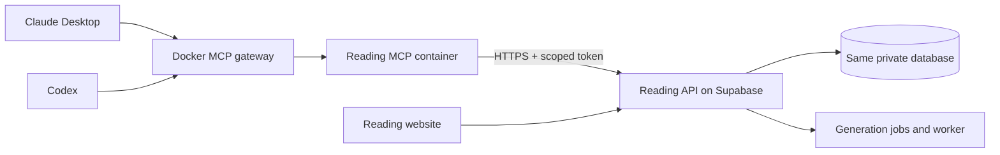

# Reading MCP for Docker, Claude and Codex

The repository ships a working MCP server in [`mcp/`](../mcp). It exposes **30 tools** for
discovery, your article queue, interests, books, reading sessions, feedback and generation.
It can run inside Docker MCP Toolkit's shared profile or directly as a local Node process.



The MCP server translates structured tool calls into API requests. It does not maintain a
second library or connect directly to Postgres. Saving an article in Claude updates the same
records you see on the website. The gateway starts the local container when needed and connects
over standard input/output; no public MCP port, domain or hosting service is needed.

## Setup on this computer

The local image `reading-app-mcp:local` is installed in the existing Docker MCP profile
`nithin_mantena`. Claude Desktop and Codex already point to that profile. Other profile servers
are preserved. The installation is staged until you provide a Reading integration token.

1. Open [Reading Preferences](https://nithinmantena.github.io/reading-app/preferences) and sign in.
2. Under **OpenClaw integration**, name a new token **Docker MCP** and click **Create token**.
   The section serves MCP too; its default scopes cover the tools below. Copy the displayed token.
3. Open PowerShell and run:

   ```powershell
   Set-Location 'C:\Users\nithi\.openclaw\workspace\obsidian\Apps\Book List\reading-app\mcp'
   node setup.mjs --token-only
   ```

4. Paste the token at the hidden prompt and press Enter. Nothing appears while typing/pasting.
   The script checks `/me`, stores it in Docker's native credential store, and updates the server
   entry in the shared profile. Do not put the token into a chat or command-line argument.
5. Run `node check.mjs --profile nithin_mantena`. A successful authenticated account check means
   the complete MCP → Docker → API connection works. This check does not edit reading data.
6. Quit and reopen Claude Desktop and Codex so their gateways reload the profile. Start with
   “Check my Reading account, then show my weekly discovery articles.”

The API base for this installation is
`https://ijwafrfvsojhouebgzkh.supabase.co/functions/v1/api/v1`.

## Installing on another computer

Prerequisites: Node 20+ (Node 22 recommended), Docker Desktop running Linux containers, and a
Docker MCP Toolkit version with profiles and native `docker pass` support. Tested with MCP CLI
v0.43.3 and Engine 29.7.2. From the repository's `mcp` directory:

```sh
npm ci --ignore-scripts
docker mcp profile ls
node setup.mjs --profile YOUR_EXISTING_PROFILE --url https://YOUR_PROJECT.supabase.co/functions/v1/api/v1
node check.mjs --profile YOUR_EXISTING_PROFILE
```

Setup builds the image locally and adds/updates only the `reading-app` server in the supplied
profile. It does not create a profile or change existing client connections. If needed, use
Docker MCP Toolkit's Clients screen to connect your clients to that profile. You can provide
`--docker` with the Docker executable path when automatic discovery cannot find it.

`--skip-token` stages installation without authentication. Later, `node setup.mjs --token-only`
finishes it. This permits tool discovery and connection testing before entering a token;
actual data calls return `not_configured` until setup is complete.

### Where configuration lives

| Location | Contains |
| --- | --- |
| Docker native credential store, `docker/mcp/reading-app.api_token` | The integration token; supplied via stdin to `docker pass set` and injected at container startup. |
| `~/.config/reading-app/mcp/config.json` | API URL, setup mode, profile ID and setup status. In Docker mode it contains **no token**. |
| `~/.docker/mcp/catalogs/reading-app.json` | Server definition: image, public API URL, secret reference, allowed API host. No token value or host mounts. |
| Local image `reading-app-mcp:local` | Node runtime, dependencies and three server source files. No credentials or personal reading data. |

Docker's secret-listing API can report an unavailable Unix socket for Windows packaged apps.
Native keychain storage and container-time injection were verified separately on this computer
and through its gateway. Setup uses this supported path; it does not disable Docker's credential
mount protections. If injection fails on another installation, update/restart Docker Desktop or
use the direct local option below.

The setup file uses a private user directory (Windows user/SYSTEM ACL, or Unix directory 0700
and file 0600). The Docker build context is an explicit allowlist and never includes setup files.
Revoke the integration token in Reading Preferences to remove access. To replace it, create a
new token and run `node setup.mjs --token-only` again, then restart the clients.

### Direct local option

Run `npm ci --ignore-scripts`, then:

```sh
node setup.mjs --local --url https://YOUR_PROJECT.supabase.co/functions/v1/api/v1
node check.mjs --local
```

This stores the token in the private configuration file instead of Docker's keychain. Setup
prints the Node executable, server path and configuration path. Add them as a stdio MCP server
in your client's configuration. For Claude Desktop, merge this entry into the existing
`mcpServers` object rather than replacing other servers:

```json
{
  "mcpServers": {
    "reading-app": {
      "command": "ABSOLUTE_PATH_TO_NODE",
      "args": ["ABSOLUTE_PATH_TO_REPO/mcp/index.mjs"],
      "env": { "READING_APP_CONFIG": "ABSOLUTE_PATH_TO_PRIVATE_CONFIG/config.json" }
    }
  }
}
```

The configuration contains paths, not the token itself. Restart the client after changing it.
Use either the Docker profile or the direct server for Reading to avoid duplicate tools.

## Remote connector (claude.ai and ChatGPT on the web and mobile)

The `api` Edge Function also serves these same 30 tools at a URL, for apps whose
connector settings only accept a URL:

```text
https://ijwafrfvsojhouebgzkh.supabase.co/functions/v1/api/k/<rap_ token>/mcp
```

It runs this folder's `createServer()` (`supabase/functions/api/mcp.ts`), and every
tool call goes through the API with that token, so scopes, versions and idempotency
are exactly as for the Docker server. Create a separate token for it on the website
(Preferences → OpenClaw integration), with every scope you want the connector to
have. The URL contains the token: treat it as a password, and revoke the token to
cut the connector off. Clients that can send headers may use `/mcp` with
`Authorization: Bearer <token>` instead.

## What to ask Claude or Codex

- “Show my weekly discovery articles and explain why each was recommended.”
- “Save the second article to my reading queue.”
- “Add history of science as an interest with weight 2.”
- “Add The Beginning of Infinity by David Deutsch to my wishlist.”
- “Mark that book finished, rate it 8.5, and leave the completion date unknown.”
- “The first recommendation is too superficial. Record that feedback and find alternatives.”
- “What is still running, and did the replacement edition finish?”

Alternatives regenerate an **entire shelf edition**, retaining its original publication
period. They do not silently replace a single card. The server returns job IDs promptly; the
client checks progress and retrieves the resulting edition when finished.

## Cost and operating limits

This integration adds no hosted MCP service or paid model dependency of its own. The local
container uses your existing Docker installation and computer. Claude/Codex usage remains
subject to your existing plans. Reading existing records and manually editing the library do
not invoke a model. Asking for generation, alternatives or missing slots runs the app's existing
server-side generation pipeline and can incur its configured model/search-provider charges,
subject to the app's budget checks. Claude being the MCP client does not replace that ranker.

Docker Desktop must be running for the Docker connection. Discovery tools return article
metadata, rationale and links; full article text requires a separate browsing capability.
MCP tools do not expose permanent deletion, credential management, bulk import or budget changes.

## Authentication

In the website's **Preferences → OpenClaw integration**, create a token named for your Claude
MCP server. Despite the section's name, these tokens work for any HTTP client. Use scopes:

```text
read
library:write
preferences:write
feedback:write
generation
```

Store these settings in your MCP server's environment or secret configuration:

```text
READING_APP_URL=https://<project-ref>.supabase.co/functions/v1/api/v1
READING_APP_TOKEN=rap_<your-token>
```

The base URL is the Supabase API URL, not the GitHub Pages website URL. Each request sends
`Authorization: Bearer <READING_APP_TOKEN>`. JSON writes also send `Content-Type: application/json`.
Keep the token in the MCP server, rather than in tool arguments, descriptions, or results.
No Supabase service-role key or GitHub login cookie is needed.

Validate configuration with `GET /me`. Revocation is available through the website. Integration
tokens cannot permanently delete books/readings or manage credentials. The current database
labels token-origin actions `openclaw`, including calls from your Claude MCP server.

## Implemented tools

All names below are actual MCP tools. Parameters and descriptions are advertised to the client
through `tools/list`; [API.md](API.md) documents the underlying HTTP contract.

| MCP tool | HTTP operation | Main inputs / result |
| --- | --- | --- |
| `reading_get_account` | `GET /me` | Connected owner, token scopes, time zone and current periods. |
| `reading_get_discovery` | `GET /recommendations` | Optional `horizon`; optional `period` and `version` require horizon. Returns shelves, article records, rationales, IDs, and job status. |
| `reading_get_discovery_archive` | `GET /recommendations/archive` | Optional horizon, limit, offset. Returns published/partial editions. |
| `reading_get_recommendation` | `GET /recommendation-entries/{id}` | Recommendation entry ID. Returns the entry, article, and source edition. |
| `reading_list_reading_queue` | `GET /readings` | Search `q`, `status`, `topic`, pagination. Discovery-only candidates are excluded by default. |
| `reading_get_reading` | `GET /readings/{id}` | Reading ID. Returns the current record and version for edits. |
| `reading_add_to_reading_queue` | `POST /readings` | `url` or `title`, optional notes/topics; `enrich:false` avoids metadata-fetch latency. |
| `reading_update_reading` | `PATCH /readings/{id}` | ID, current version, notes or status. Supports `saved`, `reading`, `finished`, `archived`. |
| `reading_save_recommendation` | `PATCH /recommendation-entries/{id}` | Entry ID; the tool sets state to saved and preserves its source edition. |
| `reading_set_recommendation_state` | `PATCH /recommendation-entries/{id}` | `read`, `dismissed`, or `active`. `read` also marks the article finished. |
| `reading_get_preferences` | `GET /preferences` | Returns interests, exclusions, feeds, reading lengths, time zone, and budget. |
| `reading_add_interest` | `POST /preferences/interests` | `topic`, optional numeric weight 0–3. Existing unrelated interests are preserved. |
| `reading_remove_interest` | `DELETE /preferences/interests/{topic}` | Topic name; the MCP server handles URL encoding. |
| `reading_update_preferences` | `PATCH /preferences` | Current version and selected settings. Useful for explicit exclusions or trusted feeds. Array fields replace their lists. |
| `reading_list_books` | `GET /books` | Search/filter/sort/pagination; supports wishlist, reading, finished, stopped, unknown, and archived records. |
| `reading_get_book` | `GET /books/{id}` | Includes reading sessions and current versions. |
| `reading_add_book` | `POST /books` | Title, authors or `author_unknown:true`; optional status, dates, rating, topics, and notes. |
| `reading_edit_book` | `PATCH /books/{id}` | ID, current version, changed fields. `archived:true` archives and `archived:false` restores. |
| `reading_start_reading_session` | `POST /books/{id}/sessions` | Dates, rating, `session_status`; supports rereads. |
| `reading_edit_reading_session` | `PATCH /reading-sessions/{id}` | Session ID/version, dates, rating, status, notes. |
| `reading_give_feedback` | `POST /feedback` | Action, target ID, optional text/scope. A recommendation entry ID is sufficient to resolve article context. |
| `reading_list_feedback` | `GET /feedback` | Optional reading/book ID and pagination. |
| `reading_edit_feedback` / `reading_remove_feedback` | `PATCH` / `DELETE /feedback/{id}` | Edit with a version; deletion excludes the event from future personalization. |
| `reading_find_alternatives` | `POST /recommendation-jobs` | Prefer `batch_id` from the displayed shelf, or supply horizon. Tool sets kind to alternatives; returns job IDs. |
| `reading_fill_discovery_gaps` | `POST /recommendation-jobs` | Batch ID or horizon; tool sets kind to fill_missing. Preserves the edition's existing picks. |
| `reading_generate_discovery` | `POST /recommendation-jobs` | Optional horizon; tool sets kind to initial. Omit horizon to queue all five. |
| `reading_get_generation_job` / `reading_list_generation_jobs` | `GET /jobs/{id}` / `GET /jobs` | Progress, failure details, and resulting batch ID on the detail endpoint. |
| `reading_get_generation_config` | `GET /generation-config` | Provider readiness, models, estimates, spend/cap, and scheduler status. |

JSON/CSV export and import remain API/website capabilities; they are not in the MCP tool set.

## Typical workflows

### Retrieve discovery and save an article

1. Call `GET /recommendations?horizon=weekly`.
2. Present `entries[].reading.title`, `canonical_url`, access classification, and the entry's
   `why_matters` / `why_fits`. Use the returned `window` when describing the edition.
3. Save the chosen **entry ID** using `PATCH /recommendation-entries/{id}` with
   `{ "state": "saved" }`.
4. Fetch the queue or article when you need its updated version.

IDs represent different things: `entry.id` identifies a recommendation card,
`entry.reading_id` identifies the article, and `batch.id` identifies the shelf edition.
The API returns metadata, descriptions, links, and recommendation rationale, not a full-text
article-reading endpoint. Fetching or opening the original is a separate client capability.

### Add an interest without replacing existing ones

```http
POST /preferences/interests
Authorization: Bearer <token>
Content-Type: application/json
Idempotency-Key: <unique-request-id>

{"topic":"History of science","weight":2}
```

Omit weight to use 1 for a new topic or preserve the weight of an existing topic. Matching is
case-insensitive and ignores repeated whitespace. To remove it, URL-encode the topic and send
`DELETE /preferences/interests/History%20of%20science`.

### Add and edit a book

Create with `POST /books`:

```json
{"title":"Example Book","authors":["Example Author"],"library_status":"want_to_read"}
```

Read the current book before editing, then send only changed fields with its version:

```json
{"version":3,"library_status":"finished","finished_on":null,"rating":8.5}
```

Dates may be unknown; do not invent them. A zero rating is valid and differs from unrated (`null`).
Book edits can update the latest reading session, and starting a finished book again preserves
the earlier session. Use session endpoints to edit a particular historical read.

### Find alternatives to a suggested edition

Read the shelf, then send:

```json
{"kind":"alternatives","batch_id":"<batch UUID from the shelf>"}
```

This creates a new version for that edition's original publication period, including if you are
viewing an archived edition. It regenerates the shelf's selections rather than replacing one
article in place. Earlier editions remain in the archive. To explain what should change, first
record explicit feedback such as `too_superficial` with the relevant recommendation entry ID.

Generation returns `202` with `jobs`, `warnings`, and `workerUrl`. Return the job ID promptly from
your MCP tool. Poll `GET /jobs/{id}` with a bounded timeout and modest interval; do not keep one
MCP request open indefinitely. When it succeeds, fetch
`GET /recommendations?horizon=<job.horizon>&period=<job.period_key>` to obtain the new edition.
If it fails, report `error`; queuing is not proof of successful generation. Jobs marked
`existing:true` reuse an active job and may have a different kind than requested.

The configured server-side model generates alternatives. Connecting Claude as an MCP client
does not change that ranker. Generation needs provider credentials and budget headroom and may
incur provider charges. Existing discovery retrieval and manual library operations do not need
new model generation.

## Reliability and development

- For supported POST operations, generate one `Idempotency-Key` per logical action and reuse
  the same key and request body on transport retries. Use a fresh key for a new user action.
- Before ordinary edits, retrieve the latest record and send `version`. On `409`, fetch it
  again and reconsider the change instead of blindly overwriting it.
- Follow list pagination (`limit`, `offset`, `total`). Defaults are bounded; a single response
  may not contain the entire library or archive.
- Return structured API errors (`error.code`, `error.message`, `requestId`) to the MCP caller.
- Keep ordinary results compact. Job detail includes checkpoints and candidate evidence;
  usually return status, stage, counts, cost, batch ID, and error rather than the full checkpoint.

The implementation enforces strict argument schemas and required versions on ordinary edits.
POST requests receive an idempotency key; on uncertain results it returns the key instead of
automatically retrying a write. Job checkpoints are omitted from detail/generation tool output.
Tests cover the actual MCP handshake and tool calls against a mock HTTP API, including write
validation, version conflicts, duplicate-request keys and error redaction.

```sh
cd mcp
npm ci --ignore-scripts
npm test
```

The dedicated GitHub workflow runs these tests and builds the Docker image. To update the local
installation after pulling changes, run:

```sh
node setup.mjs --profile YOUR_EXISTING_PROFILE --skip-token
node check.mjs --profile YOUR_EXISTING_PROFILE
```

This rebuilds the image while retaining the configured token, then refreshes the server snapshot.
Restart connected clients afterward. To remove only this integration from a profile, use
`docker mcp profile server remove YOUR_EXISTING_PROFILE --name reading-app` and revoke the token
in the website.

Implementation files: `index.mjs` owns stdio startup; `server.mjs` defines the 30 tools;
`client.mjs` handles HTTP/auth/errors; `setup.mjs` and `setup-lib.mjs` build/register/configure;
`check.mjs` verifies a read-only connection. Docker profile and server formats follow
[Docker's profile documentation](https://github.com/docker/mcp-gateway/blob/main/docs/profiles.md)
and [server specification](https://github.com/docker/mcp-gateway/blob/main/docs/server-entry-spec.md).
